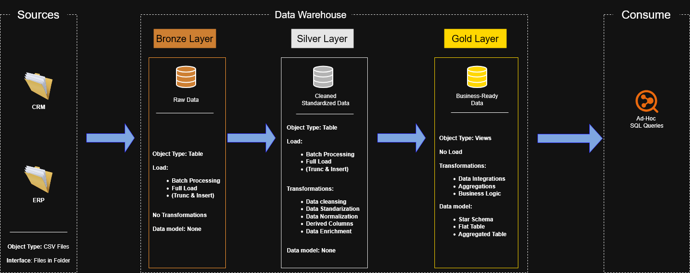

# SQL Learning Journey 🚀

This repository is my personal place for learning SQL — from absolute basics to more advanced queries, data analysis, and real-world usage.

No useless theory dumping or copy-paste tutorial spam.  
The goal is to actually understand SQL and know what I’m doing instead of memorizing random queries.

---

## 📂 Repository Structure

```bash
sql-learning/
│
├── datasets/        # Datasets used for practice
│
├── docs/            # Notes, schemas, architecture and explanations
│
└── scripts/         # SQL queries, exercises and practice files
```

## Data architecture


- Bronze Layer: Stores raw data from the source. Data is importet from CSV files into SQL Server Database.
- Silver Layer: Data cleansing, standardization, normalization for analysis.
- Gold Layer: Business ready data modelded as Star Schema

---

## 🧠 What I'm Learning Here

- SQL Basics
- SELECT / WHERE / ORDER BY
- JOINs and table relationships
- GROUP BY and aggregations
- Window Functions
- CTEs
- Subqueries
- Query optimization
- Data analysis
- Real-world SQL scenarios instead of textbook examples

---

## 🛠️ Tools

- SQL Server
- SSMS
- SQLite
- Git + GitHub

---

## 📌 Goal

I want to reach a level where I can:

- analyze data confidently,
- write clean and efficient queries,
- understand how databases actually work,
- use SQL practically for Data / AI / GameDev related work.

---

## 📈 Progress

- ✅ SQL Basics
- ✅ JOINs
- ✅ Aggregations
- ✅ Window Functions
- ⬜ Advanced Optimization
- ⬜ Stored Procedures
- ⬜ Real Data Projects

---

## ⚡ Note

Most of this repository is practical learning.

There will probably be mistakes, ugly queries, and weird solutions sometimes

That’s how real learning works.

---

## 🛡️ License

MIT License — feel free to use, modify and learn from it.

---

## 👨‍💻 About Me

FQA Tester interested in:

- SQL
- Data Analysis
- AI
- Game Development
- Tech

Currently focusing on improving technical and analytical skills, especially around databases and data-related work.
